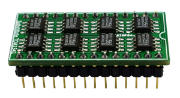
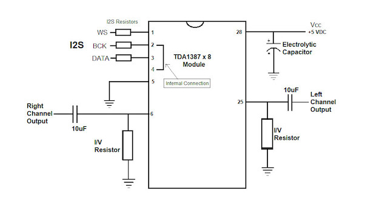
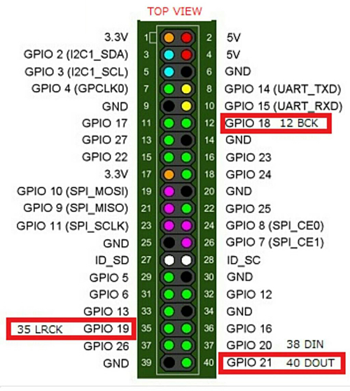

<!-- Add links to top -->

ProtoDAC TDA1387 X8 <!-- omit in toc -->
===============================================
By: @hifinet (c) 2023  
[License: MIT](#63-mit-license)

Edited by @Tim Curtis  
Date: 2023-04-10

This document describes the ProtoDAC TDA1387 X8 Non-Oversampling (NOS) Digital to Analog Converter (DAC) including technology, component sources and instructions for building the DAC.

### Table of Contents <!-- omit in toc -->

- [1. Introduction](#1-introduction)
- [2. Printed Circuit Board (PCB)](#2-printed-circuit-board-pcb)
  - [2.1. PCB Layout](#21-pcb-layout)
  - [2.2. Schematic](#22-schematic)
  - [2.3. Pin mappings](#23-pin-mappings)
- [3. Component parts](#3-component-parts)
  - [3.1. TDA1387 x 8 Module](#31-tda1387-x-8-module)
  - [3.2. Current to Voltage (I/V) resistors](#32-current-to-voltage-iv-resistors)
  - [3.3. Integrated Interchip Sound (I2S) resistors](#33-integrated-interchip-sound-i2s-resistors)
  - [3.4. Electrolytic decoupling capacitors](#34-electrolytic-decoupling-capacitors)
  - [3.5. Output coupling capacitors](#35-output-coupling-capacitors)
- [4. Assembly](#4-assembly)
- [5. moOde audio player](#5-moode-audio-player)
  - [5.1. Audio Configuration](#51-audio-configuration)
  - [5.2. Polarity Inversion](#52-polarity-inversion)
  - [5.3. CamillaDSP Settings](#52-camilladsp-settings)
  - [5.4. Resampling](#54-resampling)
- [6. Appendix](#6-appendix)
  - [6.1. PCB reference designators](#61-pcb-reference-designators)
  - [6.2. Acronyms](#62-acronyms)
  - [6.3. MIT License](#63-mit-license)

# 1. Introduction

The ProtoDAC TDA1387 X8 [ProtoDAC] is a DIY DAC based on the vintage Philips TDA1387 multibit DAC chip in an eight chip module as pictured below. The chips are configured in parallel with decoupling capacitors and pin 7 capacitors on the underside of the module.

The module is designed as a direct plug in replacement for the famous TDA1541, which is now difficult to obtain. The TDA1541 was a flagship Philips multibit 16 bit DAC in a 28 pin Dual In-line Package (DIP), and is older and more complex. The TDA1387 is a later development multibit DAC with current output, and simplified having only 8 pins.

The TDA1387 is a very interesting 16-bit design and represents the end of the multibit DAC era. It uses continuous calibration of the five most significant bit current sources, so it has 32 current sources and one spare source. Philips multibit DACs are also unique in that they do not use resistors like some other DACs, but instead use active devices to generate the currents.

The ProtoDAC is one of the easiest NOS DAC's to build. The number of components is low and the circuit design is simple since the TDA1387 directly uses I2S from the Raspberry Pi as input and passive I/V is used for the output stage.

Most importantly, the sound quality of the finished DAC is excellent, especially when using premium components.

[Back to Top](#protodac-tda1387-x8-)

# 2. Printed Circuit Board (PCB)

The PCB dimensions and layout conform to the Raspberry Pi "Hardware Attached on Top" (HAT) requirements including the standard 40-pin General Purpose Input Output (GPIO) header. All components are attached using through-hole soldering.

## 2.1 PCB Layout

NOTE: This is not final PCB revision

The Computer Aided Design (CAD) drawing of the PCB shows the board layout and location of the component parts. The design allows for several component variations including axial or radial output I/V capacitors, RCA jacks or direct wiring to PCB L/R channel out and 5V power from GPIO or via direct wiring to PCB.

|Reference designator|Component|Description|
|:-|:-|:-|
|C1,C2 or C5,C6|Output capacitors|Polypropylene Film 4.7-10uF. Radial leads with 37.5mm LS and Axial leads with 49mm LS using RCA jacks, and up to 54mm LS without RCA jacks.|
|C3,C4|Electrolytic capacitors|Audio grade 1000uF 6.3V, 10mm diameter and 5mm lead spacing. Nichicon FG (Fine Gold) or KA paired with a Panasonic FR-A adds clarity, with a wide open range and more air up top. Better than two Nichicons in testing.|
|H1|GPIO Header|Female 2X20P 40 position header connector 0.100" (2.54mm) through hole gold. DigiKey S7123-ND or eBay/AliExpress|
|R1-R3|Film Resistors|Generic metal film 430R or 470R 1/4W  Stackpole RNMF14FTC430R/RNMF14FTC470R or similar.|
|R4-R5|Foil Resistors|Audio grade Bulk Metal Foil, through hole 420R. Texas Components TX2352 or TX2575 (Vishay) https://www.texascomponents.com/store/home.asp or Charcroft in EU|
|U2|TDA1387 Module|TDA1387 x 8 Parallel Module Substitution for TDA1541. Available on eBay/AliExpress search "tda1387 tda1541" or "hifi 8pcs tda1387"|
|L/R|RCA Jacks|CA right angle PCB mount RJ-255A. Available on eBay/AliExpress search "RCA PCB DAC"|

## 2.2 Schematic

Below is a block diagram of the circuit.

## 2.3 Pin mappings

Below are the pin mappings for the GPIO header and TDA1387 X8 Module.

### I2S Input/Output

|X8 Module pin|I2S function|GPIO number|Broadcom pin|
|:-|:-|:-|:-|
|1|WS (LRCK)|19|35|
|2|BCK|18|12|
|3|DATA|21|40|
|4|BCK|18|12|

### TDA1387 X8 Module

The module is implemented as a 28 pin DIP and is connected only by pins 1-6, 25 and 28. Note that pins 2 and 4 are internally connected.

<table><tr><td style="border:none;">

|Pin|Function|
|:-|:-|
|1|WS (LRCK)|
|2|BCK|
|3|DATA|
|4|BCK|
|5|GND|

</td><td style="border:none;">

|Pin|Function|
|:-|:-|
|6|Right channel audio out|
|7-24|N/C|
|25|Left channel audio out|
|26-27|N/C|
|28|Vcc +5VDC|

</td></tr></table>

[Back to Top](#protodac-tda1387-x8-)

# 3. Component parts

Component parts for the DAC are readily available from various suppliers but since the Philips TDA1387 chips are not produced anymore the 8 x Parallel Chip Module long term availability cannot be guaranteed.

## 3.1 TDA1387 x 8 Module

The TDA1387 Integrated Circuit (IC) chips on the module are configured in parallel with decoupling capacitors and pin 7 capacitors on the underside of the board.

The chips are used and originate from the overseas chip-pull industry. Generally they are of high quality but since they are used there is a greater probability of receiving a defective part compared to new parts.

The image below shows an example chip from each of two modules. Note the orientation of the name "Thailand".

## 3.2 Current to Voltage (I/V) resistors

I worked with diyAudio user @stellarelephant, and we listened to many types of I/V resistors. We concluded that Metal foil are superior by a wide margin.

### Resistor type

Vishay naked bulk metal foil are unsurpassed, and sound very transparent with excellent detail. This may be due to the very low noise or non-inductive design. The improvement in detail compared to other resistor types is dramatic.

Bulk metal foil can be ordered to spec, but they are expensive. Metal film sound OK, and have the advantage in that they are abundant and cheap. I would recommend starting with metal film to hear the possibilities of the DAC, and then move up to Vishay metal foil resistors (if not Z-foil, then S-foil) if you think the DAC shows promise.

### Resistor value

The resistor value is critical to avoid clipping at 0dB. The I/V resistor should be no larger than 430R for Vcc of 5 VDC. I measured THD with 0 dB 1kHz sine wave input to the DAC with various I/V resistances. See the chart below. Distortion at 223.5R is measured at 0.0080% and at 322R it is 0.0097%, and THD increases linearly with resistance up to just past 430R. Then distortion starts to increase exponentially, indicating clipping.

Excessive distortion is created when the DAC is clipping. Fortunately, the TDA1387 has a high voltage compliance of 3.5V at 5V Vcc. Clipping occurs if the AC signal exceeds +3.5V or 0V. The final calculation depends on the I/V resistance and the module with its particular characteristics (DC current at idle, and the peak to peak current at full signal). The I/V resistor should be no larger than 430R for Vcc of 5 VDC.

The Vishay Z-foil resistors from Texas Components (TX2575) come in either 470R (too high) or 390R (possibly too low) as a standard resistance, but not 430R. They sell custom values for the same price. Charcroft does sell a Z-foil resistor in 430R. Note the tolerance is +/- 0.1%.

The output signal voltage decreases with a lower I/V resistor, and this may be a factor to consider in your particular system. Do you have a preamplifier that can amplify a weak signal from the DAC?

The source of Vishay S and Z-foil resistors in the US is Texas Components, and in Europe it is Charcroft . TX2575 are about $13 each without shipping. The TX2352 or S-foil is the "original" foil naked audio resistor, and are about $9 each. The Vishay S and Z foil resistors are vastly better performing in this DAC than other types.

## 3.3 Integrated Interchip Sound (I2S) resistors

Use 430R or 470R generic 1/8 or 1/4W metal film. The purpose is to limit high frequency noise on the I2S lines. I have used unshielded 10cm jumpers to an outboard proto board without a problem. Mount close to the module.

## 3.4 Electrolytic decoupling capacitors

The choice of Vcc electrolytic decoupling capacitor depends on the value of the I/V resistor in an inverse relationship.  

As the I/V resistor decreases, the capacitor needs to increase. If the capacitor is too low in value for the I/V resistor, the sound with be anemic, with weak bass and dynamics, but more 3D with deep soundstage. If the capacitor value is too high for the I/V resistor, the depth of soundstage will decrease.

For a 430R I/V resistor, 1800-2200uF is about right.

## 3.5 Output coupling capacitors

These capacitors can vary considerably in size, quality and price. You may want to press fit these in place to try different types before soldering.

The value should be around 10 uF, but can be as low as 4.7 uF. With standard 10k impedence, 10 uF will give a low frequency -3dB of 1.59 Hz. 4.7 uF will give a low frequency -3dB of 3.38 Hz.  You want the low frequency cutoff to be well below 20 Hz, ideally less than 2 Hz.

A metal foil and film capacitor will be the highest quality, but physically larger and more expensive.  

A basic polypropylene metallized film capacitor is a WIMA MKP4 or MKP10 with radial leads. Digi-Key has MKP4D046806F00JSSD which is a 6.8uF 100VDC currently in stock. WIMA MKP are commonly available, competent sounding and are a good choice for this project. Generally, most polypropylene capacitors will be satisfactory. Panasonic ECW and EZP PP caps are good, and relatively small for capacitance. PP caps can also be purchased from speaker components suppliers, where they are used as crossover caps. For example, Parts-Express, Madisound, Speaker City USA, etc. It is best to get the lowest voltage rating available, which will reduce the size. Panasonic, Solen and WIMA PP caps tend to be neutral sounding without any annoying qualities.  Humble Homemade Hifi has some capacitor ratings.

Boutique film capacitors can be very expensive and are often too large for the available space on the HAT. Metallized polypropylene tend to be the best value.

[Back to Top](#protodac-tda1387-x8-)

# 4. Assembly

Assembly consists of installing and soldering the components to the PCB. Use a high conductivity, 60/40 (Tin/Lead), rosin core, fast melting solder for example Kester 0.031 inch diameter steel-based solder.

1. Mount the three I2S resistors R1-R3 to the top of the PCB, and solder leads to the pads on the bottom.

2. Mount the module to the top of the PCB, and solder pins 1-3, 5, 6, 25 and 28 to the pads on the bottom.

3. Mount the 40 pin female header (H1) to the bottom, and solder to the pads on the top. Double check the solder joints on pins 2,4,6,12,35,40.

4. Install capacitors C1, C2 or C5, C6 to the top of the board and use convenient pads (for example, an axial capacitor could use the left C5 pad for one lead and the right C2 pad for the other lead).

5. Install the I/V resistors R4 and R5 on the top with the labeled (pretty) sides facing away from the TDA1387 module for both, and solder leads to the bottom pads. Handle with care. Use the C1, C2, C5 or C6 capacitors to physically protect the resistors i.e. mount the resistors below the top of the capacitors. Use clip on heat sinks (alligator clips or test leads) to protect the resistors during soldering.

6. Install the RCA jacks to the top of the PCB and solder to the pads on the bottom.

Perform a final quality check and inspect all soldered joints for any obvious flaws or defects, such as cracks, gaps, discoloration, or excess solder. Finally, clean off any flux residue on the PCB.

## WARNING

Since the DAC is connected to the GPIO, any assembly errors could not only damage parts on the DAC, but could also permanently damage the Raspberry Pi. Pay particular attention to the polarity markings on the electrolytic capacitors C3 and C4.

[Back to Top](#protodac-tda1387-x8-)

# 5. moOde audio player

The following sections contain the steps necessary to configure the ProtoDAC in moOde. Note The ProtoDAC does not have any configurable chip options, driver options or "hardware" volume and thus these settings will not be available in the configuration screens.

## 5.1. Audio Configuration

Click Menu, configure Audio to configure the I2S driver and Advanced Linux Sound Architecture (ALSA) output mode. The driver is configured in the "Audio Output" section. The output mode is configured in the "ALSA Options" section.

### Audio Output

Select "ProtoDAC TDA1387 X8" from the "Named I2S device" dropdown list, click SET and then Restart the system. After restarting the "Volume type" setting should show "Software".

### ALSA Options

Select "Direct (hw)" from the "Output mode" dropdown list and then click SET.

### Sound test

Click the "Home" button at the top left to return to Playback view. Set volume to a low level, scroll to the end of the Queue and click the Stereo Test track. Raise the volume to a suitable level and verify that the Left/Right channel and Phase tests produce correct results.

## 5.2. Polarity Inversion

The ProtoDAC output polarity is inverted and thus a Polarity Inversion operation must be performed on the input signal so that correct +/- polarity is output to the loudspeakers.  

Two polarity inversion options are included in moOde. The first is ALSA based which is available in the Music Player Daemon (MPD) section of the Audio Configuration screen. The second is CamillaDSP based which is available in the CamillaDSP Configuration screen.

### ALSA Polarity Inversion

+ Menu, configure Audio
+ Scroll down to the "MPD Options" section
+ Scroll down to "DSP options"
+ Click "Polarity inversion" ON
+ Click SET

### CamillaDSP Polarity Inversion

+ Menu, Configure, CamillaDSP
+ Set "Default device" to YES
+ Set "Signal processing" to Polarity Inversion or Polarity Inversion with VC (Volume Control)
+ Click SAVE

## 5.3 CamillaDSP Pipeline Settings

These settings are made in the CamillaDSP Pipeline editor

+ Menu, Configure, CamillaDSP
+ Pipeline editor ON
+ Expert mode ON
+ OPEN Pipeline editor

### Chunk Size

If using a Hardware Reclocker upstream of the ProtoDAC some latency will be introduced and so it is recommended to set the CamillaDSP chunk size to 4096 to ensure no buffer underruns occur.

+ Set Chunk size to 4096
+ Save to file

### Sample format

+ Set Capture device sampleformat to S16LE
+ Set Playback device sampleformat to S16LE
+ Save to file

### Dither

If using the Polarity Inversion with VC (Volume Control) configuration it is recommended to add a Dither filter to each channel with a target bit depth of 16 bits.

+ Menu, Configure, CamillaDSP
+ Pipeline editor ON
+ Expert mode ON
+ OPEN Pipeline editor
+ Click the "Filters" tab
+ Click + to add a Dither filter to each channel
+ Save to file

## 5.4. Resampling

Playback at the _native bitrate_ of the source audio is recommended but sometimes if specific types of distortion are audible, resampling to a higher bitrate can be used to help reduce this distortion.

One type of distortion that may be reduced by resampling is Intermodulation (IM) distortion. IM distortion is caused by the presence of ultrasonic sample images. Resampling to 384 kHz will push these ultrasonic images past 192 kHz at which IM distortion would likely be inaudible.

Another type of distortion that may be reduced by resampling is band-edge response droop which is commonly referred to as "sinc droop". This typically occurs at 20 kHz but may also occur with greatly reduced effect in lower bands.

The ProtoDAC supports sample rates from 44.1 kHz to 384 kHz and accepts bit-depths from 16 to 32 bits where the Least Significant Bits (LSB) over 16 are ignored.  

Two resampling options are included in moOde. The first is Sound eXchange (SoX) based which is available in the MPD Configuration screen. The second is CamillaDSP based which is available in the CamillaDSP Pipeline Editor screen.

### SoX Resampling  

+ Menu, Configure, MPD
+ Set Enable to "Yes"
+ Set Bit depth to "Any" or optionally to "16" if you want SoX to manage bit depth conversion instead of ProtoDAC
+ Set Sample rate to the desired rate up to 384 kHz
+ Leave Channels set to "Stereo"
+ Leave Quality set to "High (Default)"
+ SAVE

### CamillaDSP Resampling

+ Menu, Configure, CamillaDSP
+ Set Signal processing to "Polarity Inversion" or "Polarity Inversion with VC (Volume Control)"
+ SAVE
+ Scroll down to the Pipeline editor section
+ Set Status to "ON"
+ OPEN
+ Check "enable_resampling"
+ Leave "resampler_type" set to "BalancedAsync"
+ Set "samplerate" to the desired rate
+ Click "Apply to DSP" to set the rate but not save it to the configuration file
+ Click "Apply and save" to set the rate and save it to the configuration file

[Back to Top](#protodac-tda1387-x8-)

# 6. Appendix

## 6.1 PCB reference designators

|Designator|Description|
|:-|:-|
|C|Capacitor|
|H|Header|
|J|Connector|
|R|Resistor|
|U|Integrated Circuit (IC)|

## 6.2 Acronyms

|Acronym|Description|
|:-|:-|
|ALSA|Advanced Linux Sound Architecture|
|BCK|Bit Clock|
|CAD|Computer Aided Design|
|DAC|Digital to Audio Converter|
|DOUT|Data Output|
|DSP|Digital Signal Processing|
|GND|Ground|
|GPIO|General Purpose Input Output|
|HAT|Hardware Attached on Top|
|I2C|Inter-Integrated Circuit|
|I2S|Integrated Interchip Sound|
|IC|Integrated Circuit|
|I/V|Current to Voltage|
|kHz|Kilohertz|
|LSB|Least Significant Bits|
|MPD|Music Player Daemon|
|NOS|Non-Oversampling|
|PCB|Printed Circuit Board|
|SoX|Sound eXchange|
|uF|Microfarad|
|Vcc|Supply Voltage|
|VDC|Volts Direct Current|
|WS (LRCK)|Word Select (Left/Right Clock)|

## 6.3 MIT License

Permission is hereby granted, free of charge, to any person obtaining a copy
of this software and associated documentation files (the "Software"), to deal
in the Software without restriction, including without limitation the rights
to use, copy, modify, merge, publish, distribute, sublicense, and/or sell
copies of the Software, and to permit persons to whom the Software is
furnished to do so, subject to the following conditions:

The above copyright notice and this permission notice shall be included in all
copies or substantial portions of the Software.

THE SOFTWARE IS PROVIDED "AS IS", WITHOUT WARRANTY OF ANY KIND, EXPRESS OR
IMPLIED, INCLUDING BUT NOT LIMITED TO THE WARRANTIES OF MERCHANTABILITY,
FITNESS FOR A PARTICULAR PURPOSE AND NONINFRINGEMENT. IN NO EVENT SHALL THE
AUTHORS OR COPYRIGHT HOLDERS BE LIABLE FOR ANY CLAIM, DAMAGES OR OTHER
LIABILITY, WHETHER IN AN ACTION OF CONTRACT, TORT OR OTHERWISE, ARISING FROM,
OUT OF OR IN CONNECTION WITH THE SOFTWARE OR THE USE OR OTHER DEALINGS IN THE
SOFTWARE.
